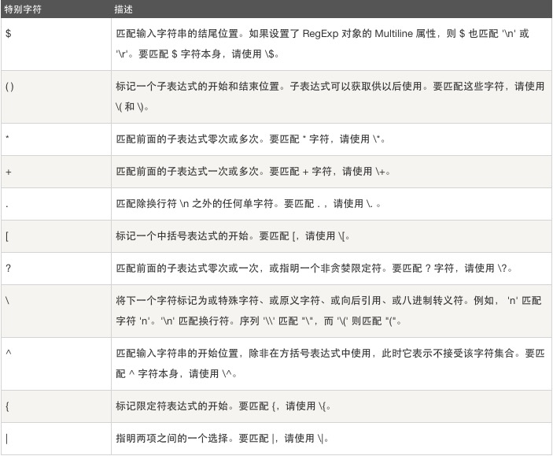
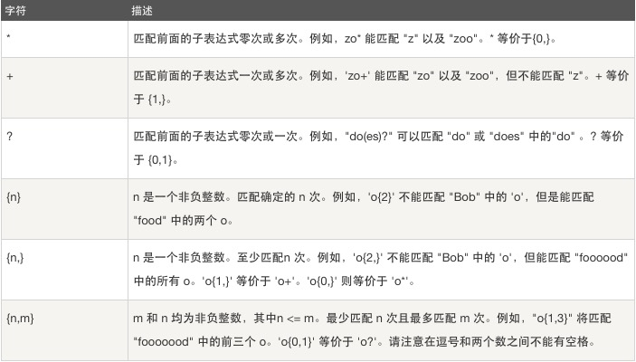
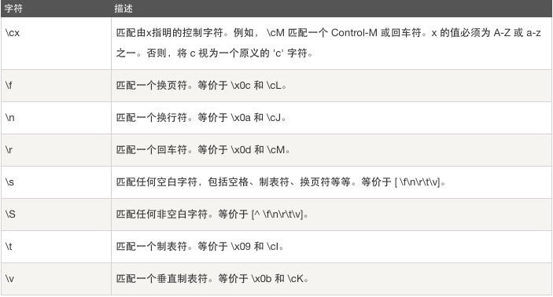
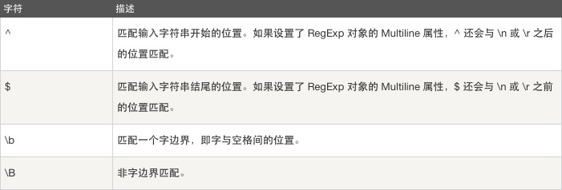
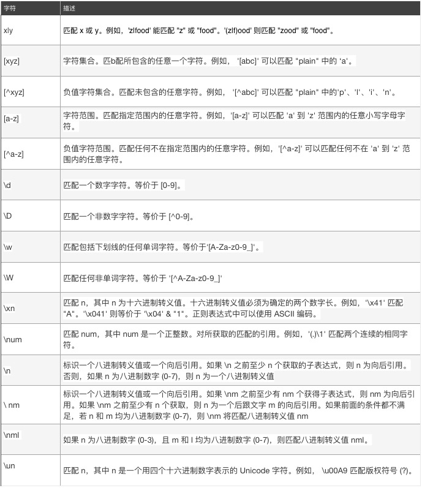
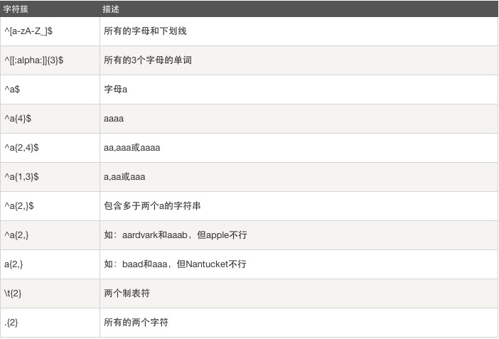

正则表达式：regular expression   
<!--break-->

# 正则表达式(RegExp）（正确的规则的表达式）   
###一、作用

1⃣️查找特定的文本，2⃣️查找并替换特定的文本

###二、语法

### 1、特殊字符

 

### 2、限定符


### 3、非打印字符


### 4、定位符 


### 5、其他


### 6、匹配规则示例
##### 6.1 开头结尾
```
^once 		匹配以once开头  
 end$ 		匹配以end结尾  
^hhhh$  	匹配精确的hhhh    

[a-z] 		匹配所有的小写字母  
[A-Z] 		匹配所有的大写字母  
[a-zA-Z] 	匹配所有的字母  
[0-9] 		匹配所有的数字  
[0-9\.\-] 	匹配所有的数字和句号减号  
[\f\r\t\n]  	匹配所有的空白符   
```
##### 6.2 非字符
``` 
[^a-z] 		匹配小写字母以外的所有字符  
[^\\\/\^] 	匹配(\)(/)(^)之外的所有字符 
[^\"\'] 	匹配双引号(")和单引号(')之外的所有字符
```
##### 6.3 确定重复出现


### 三、正则对象

####1、创建一个正则对象

```
var reg = new RegExp(pattern,modifiers);
or
var reg = /pattern/modifiers;

pattern（模式） 描述了表达式的模式
modifiers(修饰符) 用于指定全局匹配、区分大小写的匹配和多行匹配
```

#### 2、正则对象方法

| 方法        | 描述              |
| --------- | --------------- |
| compile（） |                 |
| exec（）    | 检索，返回找到的值       |
| test（）    | 检索，返回true或false |

#### 3、支持正则表达式的String对象方法

| 方法        | 描述                  |
| --------- | ------------------- |
| search（）  | 返回找到的字符串位置，没有则返回-1  |
| match（）   | 返回匹配结果的数组，没有则返回null |
| replace（） | 替换与正则表达式匹配          |
| split（）   | 把字符串分割为字符串数组        |

