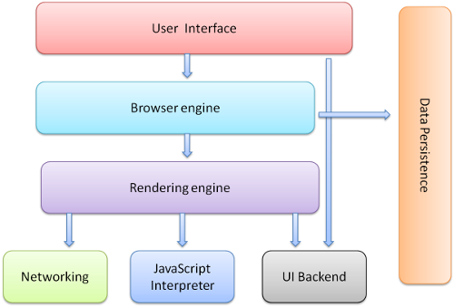

浏览器的工作原理
<!--break-->
### 浏览器的工作原理

#### 一、浏览器的组成



浏览器的主要组件：

1、用户界面

```
地址栏、前进后退按钮、书签、菜单等
```

2、浏览器引擎

```
在用户界面与渲染引擎之间传送指令
```

3、渲染引擎

```
从网络层获取请求文档的内容，开始解析渲染。主要步骤如下：
构建DOM树 + 构建CSSOM树 -> render树 -> 布局 -> 绘制
```

4、网络

```
用来完成网络调用，例如http请求，它具有平台无关的接口，可以在不同平台上工作
```

5、UI后端

```
用来绘制类似组合选择框及对话框等基本组件，具有不特定于某个平台的通用接口，底层使用操作系统的用户接口
```

6、javascript解释器

```

```

7、数据存储

```
属于持久层，浏览器需要在硬盘中保存类似cookie的各种数据，HTML5定义了web database技术，这是一种轻量级完整的客户端存储技术
```

####二、浏览器的进程与线程

| CPU    | 进程           | 线程         |
| ------ | ------------ | ---------- |
| 计算机的核心 | CPU所能处理的单个任务 | 进程中单一的顺序控制 |

多进程：比如一边听歌，一边写代码

多线程：同一程序运行多个线程

浏览器是多进程架构，常驻线程有以下几个：

1、GUI渲染线程

```
负责渲染浏览器界面HTML元素,当界面需要重绘(Repaint)或由于某种操作引发回流(reflow)时,该线程就会执行。在Javascript引擎运行脚本期间,GUI渲染线程都是处于挂起状态的,也就是说被”冻结”了。
```

2、Javascript引擎线程

```
负责解析Javascript脚本，运行代码.
是单线程
```

**GUI渲染线程与JavaScript引擎线程是互斥的。**

3、定时触发器线程

```
浏览器定时计数器并不是由JavaScript引擎计数的, 因为JavaScript引擎是单线程的, 如果处于阻塞线程状态就会影响记计时的准确, 因此通过单独线程来计时并触发定时是更为合理的方案。
```

4、事件触发线程

```
当一个事件被触发时该线程会把事件添加到待处理队列的队尾，等待JS引擎的处理。这些事件可以是当前执行的代码块如定时任务、也可来自浏览器内核的其他线程如鼠标点击、AJAX异步请求等，但由于JS的单线程关系所有这些事件都得排队等待JS引擎处理。
```

5、异步Http请求线程

```
在XMLHttpRequest在连接后是通过浏览器新开一个线程请求， 将检测到状态变更时，如果设置有回调函数，异步线程就产生状态变更事件放到 JavaScript引擎的处理队列中等待处理。
```


