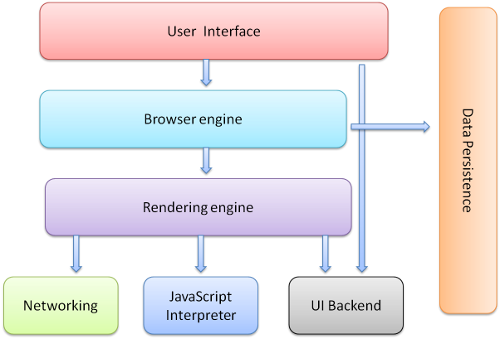

浏览器的总结
<!--break-->
####一、浏览器的组成



浏览器的主要组件：

1、用户界面

```
地址栏、前进后退按钮、书签、菜单等
```

2、浏览器引擎

```
在用户界面与渲染引擎之间传送指令
```

3、渲染引擎

```
从网络层获取请求文档的内容，开始解析渲染。主要步骤如下：
构建DOM树 + 构建CSSOM树 -> render树 -> 布局 -> 绘制
```

浏览器内核也称“渲染引擎”，用来解释网页语法并渲染到网页上。
浏览器内核决定了浏览器该如何显示网页内容以及页面的格式信息。

```
五大浏览器内核：

IE ------IE内核（Trident内核）

Firefox ——— Gecko内核

Google Chrome ------ Webkit内核 ❌ 现在是 Blink内核

Safari ------ Webkit内核

Opera ------Presto内核

其他浏览器：大部分是双内核

IE内核和webkit内核

```

4、网络

```
用来完成网络调用，例如http请求，它具有平台无关的接口，可以在不同平台上工作
```

5、UI后端

```
用来绘制类似组合选择框及对话框等基本组件，具有不特定于某个平台的通用接口，底层使用操作系统的用户接口
```

6、javascript解释器

```

```

7、数据存储

```
属于持久层，浏览器需要在硬盘中保存类似cookie的各种数据，HTML5定义了web database技术，这是一种轻量级完整的客户端存储技术
```

####二、浏览器的进程与线程

| CPU    | 进程           | 线程         |
| ------ | ------------ | ---------- |
| 计算机的核心 | CPU所能处理的单个任务 | 进程中单一的顺序控制 |

多进程：比如一边听歌，一边写代码

多线程：同一程序运行多个线程

浏览器是多进程架构，常驻线程有以下几个：

1、GUI渲染线程

```
负责渲染浏览器界面HTML元素,当界面需要重绘(Repaint)或由于某种操作引发回流(reflow)时,该线程就会执行。在Javascript引擎运行脚本期间,GUI渲染线程都是处于挂起状态的,也就是说被”冻结”了。
```

2、Javascript引擎线程

```
负责解析Javascript脚本，运行代码.
是单线程
```

**GUI渲染线程与JavaScript引擎线程是互斥的。**

3、定时触发器线程

```
浏览器定时计数器并不是由JavaScript引擎计数的, 因为JavaScript引擎是单线程的, 如果处于阻塞线程状态就会影响记计时的准确, 因此通过单独线程来计时并触发定时是更为合理的方案。
```

4、事件触发线程

```
当一个事件被触发时该线程会把事件添加到待处理队列的队尾，等待JS引擎的处理。这些事件可以是当前执行的代码块如定时任务、也可来自浏览器内核的其他线程如鼠标点击、AJAX异步请求等，但由于JS的单线程关系所有这些事件都得排队等待JS引擎处理。
```

5、异步Http请求线程

```
在XMLHttpRequest在连接后是通过浏览器新开一个线程请求， 将检测到状态变更时，如果设置有回调函数，异步线程就产生状态变更事件放到 JavaScript引擎的处理队列中等待处理。
```


#### 四、浏览器构建页面的过程
#####   1、浏览器加载过程
1.浏览器输入网址  
2.浏览器根据域名解析ip地址  
3.给web服务器建立TCP连接，然后发送http请求。  
4.服务器的永久重定向响应    
服务器给浏览器响应一个301永久重定向响应，这样浏览器就会访问“http://www.facebook.com/” 而非“http://facebook.com/”  
5.浏览器跟踪重定向地址，并发送一个http请求。  
6.服务器处理请求，发回HTML响应。  
7.释放TCP连接，浏览器解析HTML内容。  

#####   2、浏览器渲染过程
解析html构建dom树->解析css，生成css规则树->css规则树和dom树一起构建render树（渲染树）->Layout（计算每个节点在屏幕中的位置）->绘制render树（绘制每个节点）  
概念：
回流：当它发现了某个部分发生了变化影响了布局，那就需要倒回去重新渲染。  

重绘：如果只是改变了某个元素的背景颜色，文字颜色等，不影响元素周围或内部布局的属性，将只会引起浏览器的repaint，重画某一部分。  

#####3、优化加载和渲染

*1、压缩js，css文件*

css、js优化，使用压缩工具进行打包压缩，减小文件体积，并能合并为一个文件，这样浏览器能减少请求次数，请求文件大小。项目中使用gulp，webpack 压缩工具。  

2、控制资源文件加载优先级 

浏览器解析html是从上往下，CSS 提前加载，把js放在body底部。

3、利用浏览器缓存

4、图片优化

使用图标字体代替图片，

#####4、浏览器性能工具 

chrome devtools timeline 

1、工具栏  

 
<br/>
capture后面的的选项分别是：网络、js简介、截图、存储、描绘  
用户可以选者需要捕获的选项

2、信息栏  

 
<br/>
1：FPS 每秒刷新频率
浏览器刷新频率是60次／秒，如果页面有动画或者渐变效果，那么浏览器渲染动画或页面的每一帧时间要在1秒/60次 = 16毫秒以内，这样我们才不会感觉到卡顿，实际每帧的时间大约为10秒，因为浏览器还要做一些渲染队列管理，渲染线程切换等。  
2:CPU cpu资源占用   
表明消耗cpu资源 

3:NET  
不同颜色代表不同资源请求  
浅色代表资源请求被发送到收到第一个响应字节的时间，深色代表从收到第一个字节到这个资源完全下载完成。  

####五、javascript获取浏览器基本信息   

1、Window对象

window.screen.width 、window.screen.height  屏幕的宽度

Window.innerWidth 浏览器窗口的宽度

2、Document对象

document.documentElement ——对应<html>节点

document.body ———对应<body>节点

Element.clientWidth 属性 表示元素的内部宽度，以像素计。该属性包括内边距，但不包括垂直滚动条（如果有的话）、边框和外边距。

```
document.documentElement.clientWidth HTML的宽度 = 浏览器的显示宽度（不包括滚动条，不包括超出显示区域的值）
```


```
document.body.clientWidth 视窗的宽度 等于上面的值
document.body.scrollWidth body的总共宽度
```

注：浏览器刷新的时候  html宽度=浏览器窗口宽度

3、计算浏览器滚动条宽度

```
window.innerWindow - ducument.body.clientWidth  
```

####六、跨域（cors）


####七、浏览器会话识别、身份验证机制

cookie和session

1.cookie机制

为了实现会话跟踪，将用户状态信息存储到客户端的一种机制。

2.session机制

为了实现会话跟踪，将用户状态信息存储到服务端的一种机制。实现session也需要cookie支持，服务器给浏览器一个SESSIONID，然后请求的时候根据SESSIONID来判断会话状态。

####八、浏览器本地存储（webStorage）

webStorage分为localStorage和sessionStorage，用来存储比较大的数据。容量都为5M左右，不同浏览器有差异，比cookie只有4k大很多。

localStorage与sessionStorage区别：

localStorage：永久化的本地存储。

sessionStorage：会话关闭（浏览器窗口关闭，数据会被销毁）

####九、浏览器http请求

####十、浏览器兼容性问题汇总

IE兼容：

自己在工作中遇到的兼容性问题

```
1、随便写几个标签，不加样式控制的情况下，各自的margin 和padding差异较大。
	 解决方案：css里 *{margin:0;padding:0;}
2、日期格式
new Date(2009,1,1);       //正确  
new Date("2009/1/1");    //正确  
new Date("2009-1-1");		//chrome 可以 safari 非法
3、一、input type=number
```


